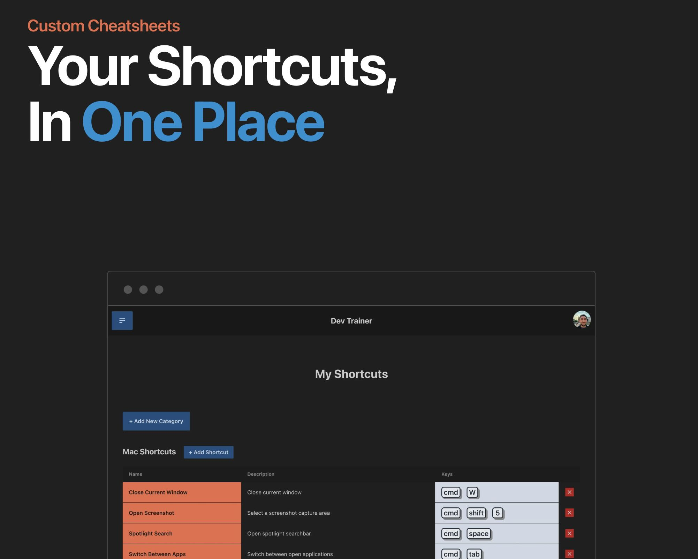
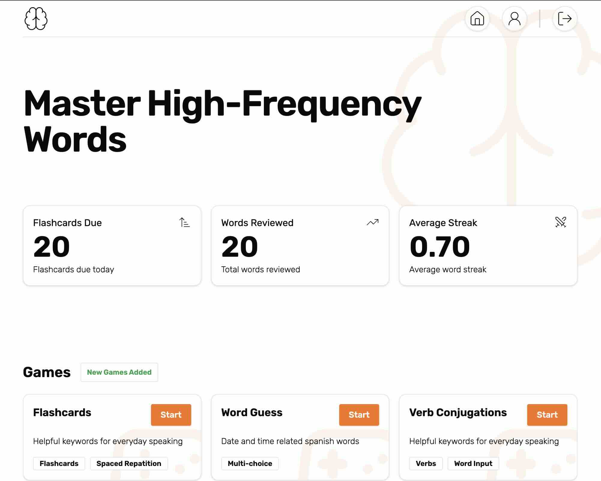

# Ryan Bowler

#### 👋 &nbsp;Connect With Me

#### 🛠 &nbsp;Tech Stack

&nbsp;
&nbsp;
&nbsp;
&nbsp;
&nbsp;
&nbsp;

&nbsp;
&nbsp;

&nbsp;

&nbsp;
&nbsp;
&nbsp;

#### 🥷 &nbsp;Codewars

  

#### 💼 &nbsp;Projects

<table bordercolor="#66b2b2"> 
  <tr>
    <!-- Project 1 -->
    <td width="50%" valign="top">
      <h3 align="center">Dev Trainer</h3>
       
      
      

      

        
        &nbsp;&nbsp;
        
      

       
      
<strong>TypeScript, React, Next.js, Node.js, Express.js, MongoDB, Redis, Tailwind</strong> - Master keyboard shortcuts through personalized lists. Features include custom shortcut organization, an admin panel for content management and AI for generating code snippets.

    </td>
    <!-- Project 2 -->
    <td width="50%" valign="top">
      <h3 align="center">Better Spanish</h3>
       
      
      

      

        
        &nbsp;&nbsp;
        
      

       
      
<strong>TypeScript, React, Next.js, Tailwind, Drizzle</strong> - Master Spanish faster with a focus on high-frequency words. Features include verb conjugation practice, flashcards with spaced repetition algorithms and personalized progress tracking.

    </td>
  </tr>
  <tr>
    <!-- Project 3 -->
    <td width="50%" valign="top">
      <h3 align="center">My Portfolio</h3>
       
      
      

      

        
        &nbsp;&nbsp;
        
      

       
      
<strong>TypeScript, Astro, Tailwind & GSAP</strong> - A modern, responsive portfolio website showcasing my work as a Full Stack Developer. Built with Astro for optimal performance and user experience.

    </td>
    <!-- Project 4 -->
    <td width="50%" valign="top">
      <h3 align="center">Dymoné</h3>
       
      
      

      

        
        &nbsp;&nbsp;
        
      

       
      
<strong>TypeScript, React, Next.js, Tailwind, Sanity, Stripe</strong> - An e-commerce site for a luxury jewellery online retailer, intergrated with Sanity as the CMS and Stripe to process payments and manage products.

    </td>
  </tr>
</table>
