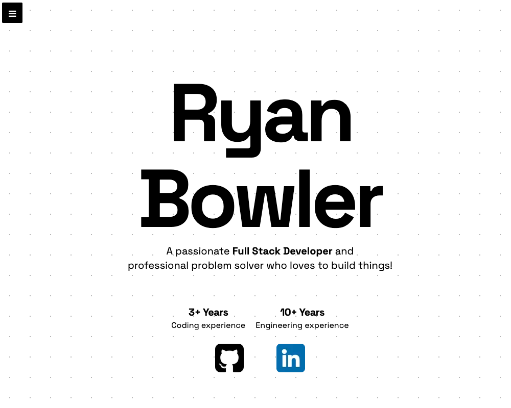

# Ryan Bowler

#### 👋 &nbsp;Connect With Me

#### 🛠 &nbsp;Tech Stack

&nbsp;
&nbsp;
&nbsp;
&nbsp;
&nbsp;
&nbsp;
&nbsp;
&nbsp;
&nbsp;
&nbsp;
&nbsp;
&nbsp;

#### 💼 &nbsp;Projects

<table bordercolor="#66b2b2"> 
  <tr>
    <!-- Project 1 -->
    <td width="50%" valign="top">
      <h3 style="text-align: center;">Dev Trainer</h3>
       
      
       
      

          
        
      

      
<strong>Typescript, React, Next.js, Node.js, Express.js, MongoDB, Tailwind & DaisyUI</strong> - Platform to...

    </td>
    <!-- Project 2 -->
    <td width="50%" valign="top">
      <h3 style="text-align: center;">Better Spanish</h3>
       
      
       
      

        
        
      

      
<strong>Typescript, React, Next.js, Tailwind, Node.js, & Express.js</strong> - Platform to...

    </td>
  </tr>
  
  <tr>
    <!-- Project 3 -->
    <td width="50%" valign="top">
      <h3 style="text-align: center;">My Portfolio</h3>
       
      
       
      

        
        
      

      
<strong>Typescript, Astro, Tailwind & GSAP</strong> - A modern, responsive portfolio website showcasing my work as a Full Stack Developer. Built with Astro for optimal performance and user experience

    </td>
    <!-- Project 4 -->
    <td width="50%" valign="top">
      <h3 style="text-align: center;">Shoe Junky</h3>
       
      
       
      

        
        
      

      
<strong>Typescript, React, Next.js, Tailwind, Node.js, & Express.js</strong> - Platform to...

    </td>
  </tr>
</table>
